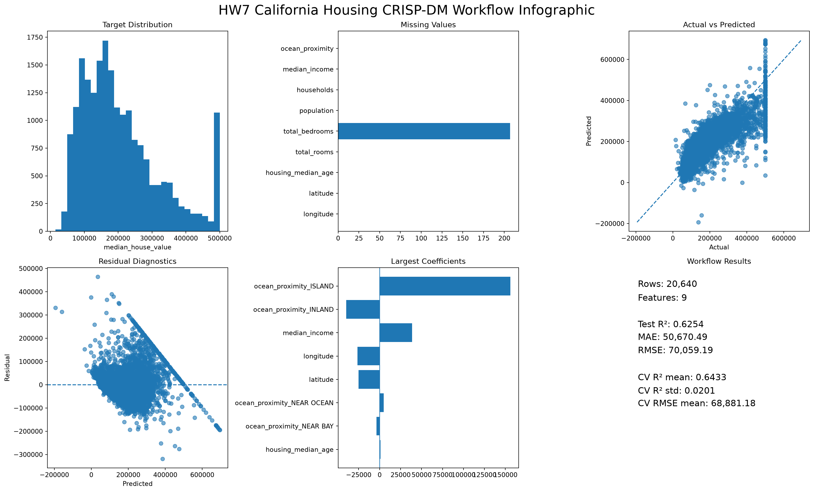
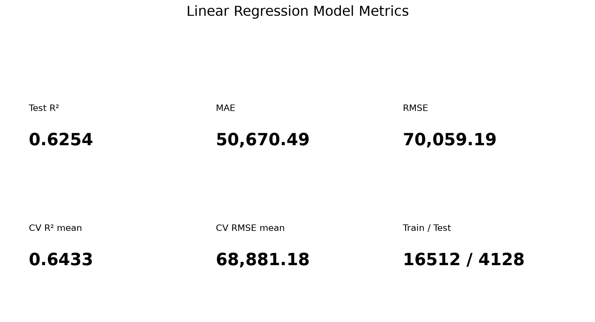

# 🏠 Interactive Demo

[Open Interactive Workflow Dashboard](https://harrywhite-tw.github.io/hw7_california_housing_workflow/)





# HW7 California Housing Reusable Regression Workflow

This project extracts the repeatable workflow from the HW6 50 Startups CRISP-DM analysis and validates that workflow on the full California Housing dataset. The workflow is the core deliverable: it downloads or reads a CSV, validates the schema, preprocesses numerical and categorical features, trains a linear regression pipeline, writes metrics, saves artifacts, and publishes static dashboard data. The repository-scoped Codex Skill is intentionally a lightweight interface around the tested workflow, not a second implementation. This is not AutoML, and model coefficients or correlations should not be interpreted as causal evidence.

- [Interactive Dashboard](https://harrywhite-tw.github.io/hw7_california_housing_workflow/)
- [Workflow Specification](WORKFLOW.md)
- [Implementation Plan](docs/HW7_IMPLEMENTATION_PLAN.md)
- [Validation Record](docs/VALIDATION.md)
- [Codex Skill](.agents/skills/tabular-regression-workflow/SKILL.md)

## Verified Local Results

Windows local validation was completed with Python 3.12.10 and the full California Housing dataset.

- Tests: `2 passed in 3.68s`
- Dataset: 20,640 rows, 10 columns, 9 configured features
- Test R²: 0.6254
- Test MAE: 50,670.49
- Test RMSE: 70,059.19
- 5-fold CV R² mean/std: 0.6433 / 0.0201
- 5-fold CV RMSE mean/std: 68,881.18 / 1,988.10

## Core Deliverables

- California Housing regression configuration
- Automatic CSV download when local data is absent
- Schema validation
- Numerical median imputation
- Categorical most-frequent imputation
- One-hot encoding
- scikit-learn `Pipeline` + `ColumnTransformer`
- Multiple linear regression
- Train/test R², MAE, RMSE
- K-fold CV R² and RMSE
- Saved preprocessing + model pipeline
- Predictions, residuals, and coefficient table
- Seven PNG visual artifacts
- CRISP-DM Markdown report
- Static GitHub Pages showcase data
- Automated smoke test
- Lightweight Codex repository Skill

## Repository Structure

```text
.
├── .agents/skills/tabular-regression-workflow/SKILL.md
├── configs/
├── data/
├── docs/
├── outputs/
├── site/
├── src/
├── tests/
├── AGENTS.md
├── WORKFLOW.md
├── index.html
├── requirements.txt
└── run_workflow.py
```

## Quick Start

Create a virtual environment:

```powershell
python -m venv .venv
```

Install dependencies:

```powershell
.\.venv\Scripts\python.exe -m pip install -r requirements.txt
```

Run tests:

```powershell
.\.venv\Scripts\python.exe -m pytest
```

Run the California Housing workflow:

```powershell
.\.venv\Scripts\python.exe run_workflow.py --config configs\california_housing.json
```

If `data/housing.csv` is missing, the workflow downloads the configured source automatically.

## Generated Outputs

The real workflow writes these files under `outputs/` and `site/`:

- `outputs/metrics.json`
- `outputs/dataset_summary.json`
- `outputs/predictions.csv`
- `outputs/feature_coefficients.csv`
- `outputs/california_housing_model.pkl`
- `outputs/workflow_report.md`
- `outputs/dataset_overview_dashboard.png`
- `outputs/correlation_heatmap.png`
- `outputs/actual_vs_predicted.png`
- `outputs/residual_diagnostics.png`
- `outputs/feature_coefficients.png`
- `outputs/model_metrics_summary.png`
- `outputs/homework_infographic.png`
- `site/results.js`

## Workflow and Skill

- [`WORKFLOW.md`](WORKFLOW.md) defines the reusable CSV regression workflow contract.
- [`.agents/skills/tabular-regression-workflow/SKILL.md`](.agents/skills/tabular-regression-workflow/SKILL.md) gives Codex a thin project-specific entry point for running and validating the workflow.

## Documents

- [Approved implementation plan](docs/HW7_IMPLEMENTATION_PLAN.md)
- [Design notes](docs/DESIGN.md)
- [Codex finalization task packet](docs/CODEX_TASK_PACKET.md)
- [Validation record](docs/VALIDATION.md)
- [GitHub setup](docs/GITHUB_SETUP.md)

## Interpretation Boundary

This is an educational workflow demonstration. Model coefficients and correlations do not prove causal effects on housing prices.
